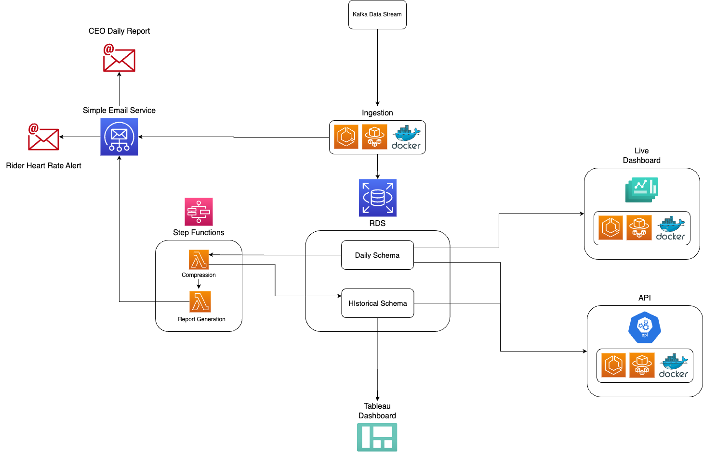

# Deloton 🚴‍♀️🚴‍♂️🚴

Repository for SigmaLabsXYZ Deleton project. This Repo allows the construction of a architecture which collects raw Deleton kafka bike data to be processed for streams of outputs for visualisation.

- [Usage](#usage--outputs-)📊
- [Architecture](#architecture-%EF%B8%8F)🏛️
- [Files](#files-)📁
- [Installation](#installation-%EF%B8%8F)⬇️

🚵‍♀️🚴🏿‍♀️🚴🏽🚵‍♂️🚴🏻🚵🏿‍♀️🚴‍♀️🚴‍♂️🚴🚵‍♀️🚴🏿‍♀️🚴🏽🚵‍♂️🚴🏻🚵🏿‍♀️🚴‍♀️🚴‍♂️🚴🚵‍♀️🚴🏿‍♀️🚴🏽🚵‍♂️🚴🏻🚵🏿‍♀️🚴‍♀️🚴

#

## Usage / Outputs 📊

### API

To view and access riders information using our restful API, access the API via link obtained from loadbalancer with the authentication needed for deleting a ride. Below are end-points where you can access different information.

- Get Ride information via ride id

  - With extension "/ride/int:ride_id/", where ride_id is replaced with the ride you're inquiring about. If valid, you will receive rides start time, end time, rider_id, bike serial

- Get Riders information via rider id

  - With extension "/rider/int:rider_id/", where rider_id is replaced with the rider you're inquiring about. If valid, you will receive riders id, name, gender, address, date of birth, email, height, weight, account creation date.

- Delete a ride via ride id

  - With extension

- Get Rides duration via ride id

  - With extension "/rider/int:rider_id/duration/", where rider_id is replaced with the ride you're inquiring about. If valid and has ended, you will receive the rides duration.

- Get daily rides completed today

  - With extension "/daily/", you will be able to see all the rides which are currently occurring or have been completed today.

- Get leaderboard of which rider has completed the most rides

  - With extension "/leaderboard/", you will be able to see a leaderboard of all the riders in order of who has completed the most rides.

- Get rides in a specific city

  - With extension "/city/<city>", where city is replaced with the city you;re inquiring about. If valid , you will recieve all the rides which have taken place or occurring in the city.

##

### Dashboard

##

To view realtime dashboard for riders at a glance using the link provided from the loadbalancer

#### Current ride

  - From entering rider id, you will be able to see you details, including current heart rate, cumulative power and, average power and resistance.
  
##
##

#### Recent rides

  - You will be able to see two graphs which show all the rides in a bar chart, where one is split via age bracket and other is split via gender.

### Tableau

To view the live tableau dashboard, please login to our tableau server

  

- Above image shows leaderboard of riders which can be filtered on longest individual ride, highest power output and longest cumulative ride time by a rider.

##

##

### Daily report

  

- Example of the daily report given to C-suits each day via email, where we see total number of riders and 4 graphs. Graph 1 showing the riders of the past day split by gender, graph 2 showing riders of the past day split by age brackets, graph 3 showing average heart rates of riders during the day, and the last graph showing average power of riders during the day.

🚵‍♀️🚴🏿‍♀️🚴🏽🚵‍♂️🚴🏻🚵🏿‍♀️🚴‍♀️🚴‍♂️🚴🚵‍♀️🚴🏿‍♀️🚴🏽🚵‍♂️🚴🏻🚵🏿‍♀️🚴‍♀️🚴‍♂️🚴🚵‍♀️🚴🏿‍♀️🚴🏽🚵‍♂️🚴🏻🚵🏿‍♀️🚴‍♀️🚴

#

## Architecture 🏛️

### Diagram illustrating the projects architecture

##

##

##

##

### Extract

##

1. Kafka

- This section provides the input raw data from the bikes, which would need to be cleaned for the rest of the pipeline.

2. Ingestion script

- This section is the python script which connects to the kafka for the live data, which is extracted and cleaned. This is on a ECS which is running constantly, to upload the clean data to our RDS.

### Load

##

4. RDS, database

- This section of the pipeline is where we load the data which has been cleaned and checked. The initial data from the ingestion script, would be loaded into our daily schema of the database. There is also a historical schema for data greater than 12 hours in age.

### Transform

##

4. Step-function
   4.1. Compress data script

- This section takes the data from the daily schema of the RDS and using a lambda script, we compress the data to then be pushed to the historical schema.
  4.2. Report generation script

- This section takes the data from the historical schema and generates a PDF of key graphs for the C-suit executives.

### Output

##

1. Alerts

- This section is connected to the ingestion script where using AWS services, we can send email notifications for any heart readings beyond the normal boundaries.

2. API

- This section takes data from the daily and historical schema to present some of the key information on riders and their rides, which they will be able to access via the API, which is hosted on a load-balancer via AWS services.

2. Daily report

- This section takes the PDF from the report generation script and produces an email with the PDF attached.

2. Tableau

- This section provides some analyses for Data Analysts, key information on historical rides which have taken place.

ZOOM

#

## Files 📁

### Ingestion

#### This folder contains files related to the ingestion for our pipeline, which gathers data from the kafka.

##

- `ingestion.py` : This file allows us to consume and sort the kafka data, which is then sent to the database for short term storage

- `ingestion_utils.py` : This file can be considered as a helper function for the ingestion.py in order to split the raw data

- `ingestion_sql.py` : This file holds type definitions with the SQL commands, to reduce the cluttering of the code.

- `Dockerfile` : This file allows us to containerize this folder to be than run on any machine with only its dependencies.

- `test_ingestion.py` : This file contains pytest scripts to tests aspects of the ingestion.py, to make sure it is functioning.

- `requirements.txt` : This file contains a list of the required Python packages to run the scripts in this folder.

### Terraform

#### This folder contains the files related to the creation of all of our AWS services, including RDS. Lambda functions and ECRs.

##

- `ecr.tf` : This file contains the the terraform resource creation for the ECR for each part of the architecture.

- `ecs.tf` : This file contains the ECS dependable resources such as the clusters, task definitions and event bridge.

- `main.tf` : This file contains the resource creation for the lambdas and step function, which will host our python scripts on the cloud. This includes the IAM policy as well.

- `rds.tf` : This file contains the resource creation for the RDS database using the referenced security groups and VPC subnets.

- `setup.tf` : This file contain resource parameters other services would use like the VPC, VPC subnets and security groups.

- `variables.tf` : This file contains variables which are referenced throughout each terraform file, such as database name and port.

- `create_db.sql` : This file contains the sql script to create the database and the tables in each schema.

### Compress_data

#### This folder contains the files required to transfer the data from the AWS RDS daily schema to the historical schema

##

- `compress_data.py` : This file extracts all rider information exceeding the past 24 hours from the daily schema, formats it, and uploads the data to the historical schema. Additionally, it deletes data in the daily historical schema that is older than 12 hours.

- `compress_sql.py` : This file contains all the SQL commands for the compress_data.py, to allow easier code consumption.

- `Dockerfile` : This file allows us to containerize this folder to be than run on any machine with only its dependencies.

- `requirements.txt` : This file contains a list of the required Python packages to run the scripts in this folder.

### Report_generation

#### This folder contains the files which create the documentation for the C-suite, attached to an email.

##

- `report.py` : This file uses the daily schema and extracts several graphs and information from the last 24 hours to form a PDF, which is then sent in an email.

- `report_utils.py` : This file contains "helper" functions for the report.py to help make the report.py easier to consume.

- `Dockerfile` : This file allows us to containerize this folder to be than run on any machine with only its dependencies.

- `deleton.png` : This is a image of the Deleton logo used in the PDF.

- `requirements.txt` : This file contains a list of the required Python packages to run the scripts in this folder.

### Live_dashboard

#### This folder contains the files which create the dashboard using flask, for the riders.

##

- `dash_utils.py` : This file contains the python scripts to contact the database and form the figures needed in the dashboard.

- `sql_vars.py` : This file contains the SQL commands used in the dash_utils.py to allow that file to be easier to consume.

- `app.py `: this file contains the dash template used by each page, which holds the navigation bar and references to the pages.

- pages

  - `current_ride.py `: This file contains the plotly graphs of the current heart rate, resistance and power graphs.

  - `recent_rides.py` : This file contains the plotly graphs of the recent rides and shows the gender split and age groups.

- `Dockerfile` : This file allows us to containerize this folder to be than run on any machine with only its dependencies.

- `requirements.txt` : This file contains a list of the required Python packages to run the scripts in this folder.

### API

#### This folder contains the files which create the restful API to access rider information.

##

- `app.py` : This file contains all the functions for each end point accessible through the api.

- `helper_function.py` : This file has functions used by the `app.py` for set-up and to allow the `app.py` to be more consumable.

- `Dockerfile` : This file allows us to containerize this folder to be than run on any machine with only its dependencies.

- `requirements.txt` : This file contains a list of the required Python packages to run the scripts in this folder.

🚵‍♀️🚴🏿‍♀️🚴🏽🚵‍♂️🚴🏻🚵🏿‍♀️🚴‍♀️🚴‍♂️🚴🚵‍♀️🚴🏿‍♀️🚴🏽🚵‍♂️🚴🏻🚵🏿‍♀️🚴‍♀️🚴‍♂️🚴🚵‍♀️🚴🏿‍♀️🚴🏽🚵‍♂️🚴🏻🚵🏿‍♀️🚴‍♀️🚴

#

## Installation ⬇️

To run this repo you will need to do the steps below.

NOTE. For the installation process you should have terraform installed, add environment variables in /terraform/variables.tf and adjust deloton.sh with docker terminal lines with AWS account name. Alongside with any for terraform dependencies.

- run `deloton.sh` in terminal

- once complete you should receive the following terminal line
  `Apply complete! Resources: 37 added, 0 changed, 0 destroyed.`. All outputs should now be up and running.

🚵‍♀️🚴🏿‍♀️🚴🏽🚵‍♂️🚴🏻🚵🏿‍♀️🚴‍♀️🚴‍♂️🚴🚵‍♀️🚴🏿‍♀️🚴🏽🚵‍♂️🚴🏻🚵🏿‍♀️🚴‍♀️🚴‍♂️🚴🚵‍♀️🚴🏿‍♀️🚴🏽🚵‍♂️🚴🏻🚵🏿‍♀️🚴‍♀️🚴‍♂️

#
